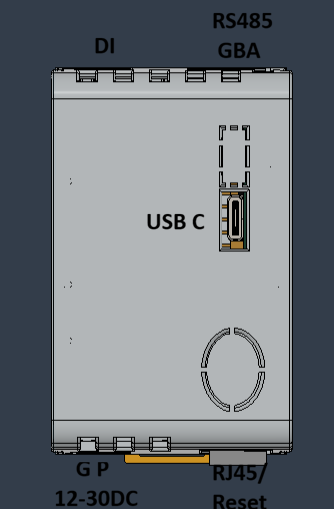

# Anschlüsse & Bedienelemente

## Übersicht

Die folgende Abbildung zeigt die Position der Schnittstellen am Gerät.



Die folgenden Anschlüsse/Funktionen sind für die Standardausführung vorgesehen.

| Bereich | Element | Zweck / Hinweis |
|---|---|---|
| Versorgung | **12–30 V DC** (Schraub-/Push‑In‑Klemme) | Kleinspannungsversorgung, Polung gemäß Beschriftung am Gerät |
| Netzwerk | **RJ45 Ethernet (Gigabit)** | Netzwerkzugang; mit PoE |
| USB | **USB‑C** | Erweiterungen (z. B. WLAN‑Stick, USB‑Peripherie); je nach System auch Service/Diagnose |
| Feldbus | **RS485 (on‑board)** | Serielle Schnittstelle für Feld-/Zähler-/Gateway‑Anbindungen. **Klemmenbelegung: G (GND), B, A** |
| Digitaleingang | **DI (EnWG §14a)** | Digitaler Eingang für ein Steuersignal (nicht galvanisch getrennt), Es muss ein Relais Kontakt verwendet werden |


## RS485 (on‑board)

- Klemmen: **G (GND)**, **B**, **A**
- Verwendung: Integrationsabhängig (z. B. Zähler/Gateway/Feldbus‑Anbindungen)

## Digitaler Eingang (EnWG §14a)

- Eingangssignal: Steuersignal
- Hinweis: Der Eingang ist **nicht potentialfrei**. Es muss ein Relais Kontakt verwendet werden.

## Taster

- **Reset/NetMode‑Taster:** unterhalb der RJ45‑Buchse.
  - Funktion: Netzwerk‑Recovery (DHCP/Default‑IP) → siehe *Software → NetMode*.

## LEDs

- **NetMode‑LED:** zeigt, ob der Netzwerk‑Recovery‑Modus (NetMode) aktiv ist.
- **DI‑LED (EnWG §14a):** zeigt den Status des digitalen Eingangs an.

## Versorgungsempfehlung

- Netzteil: **mindestens 15 W**
- Absicherung: gemäß verwendetem **Netzteil (Zukauf)** und Installation durch Elektrofachkraft

## Quellen (Hardwarebasis)

- Radxa ZERO 3E Product Brief (USB/Ethernet/PoE‑Hinweise):
  - https://dl.radxa.com/zero3/docs/hw/3e/radxa_zero_3e_product_brief.pdf

## Fotos

Ablage:

`docs/assets/images/`

Empfohlene Dateinamen:

- `device-front.jpg` – Frontansicht
- `ports-overview.png` – Schnittstellenübersicht (Diagramm)
- `ports-bottom-power-rj45.jpg` – Unterseite: 12–30 V DC + RJ45
- `ports-top-di-rs485.jpg` – Oberseite: DI + RS485 (G/B/A)
- `ports-topview-usbc.jpg` – Draufsicht/Seite: USB‑C
- `device-button-led.jpg` – Reset/NetMode‑Taster + LED (unterhalb RJ45)
- `device-label.jpg` – Typenschild/Seriennummer

Einbindungsbeispiel:

```markdown

```
