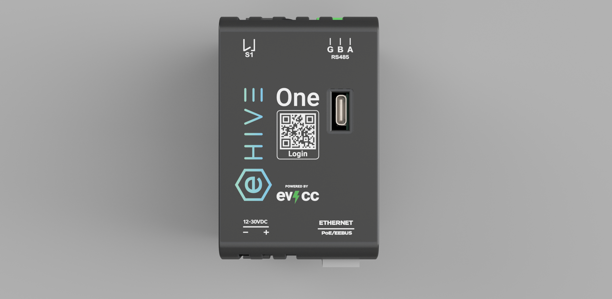
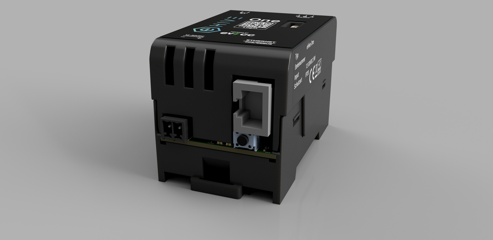
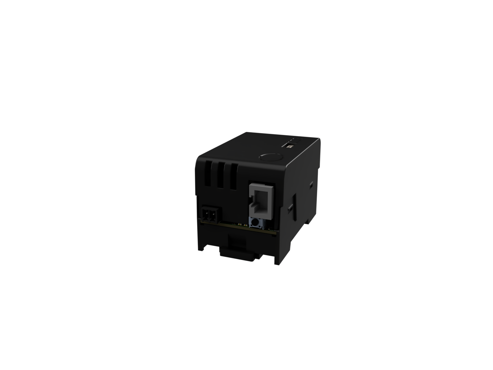

# Anschlüsse & Bedienelemente

## Übersicht

Die folgenden Fotoansichten zeigen die Position der Schnittstellen am Gerät.

### QR mit USB-C

### Ethernet + Versorgung + NetMode-Taster

### RJ45, 12-30 V DC, NetMode Taster + LED

Die folgenden Anschlüsse/Funktionen sind für die Standardausführung vorgesehen.

| Bereich | Element | Zweck / Hinweis |
|---|---|---|
| Versorgung | **12–30 V DC** (Schraub-/Push‑In‑Klemme) | Kleinspannungsversorgung, Polung gemäß Beschriftung am Gerät |
| Netzwerk | **RJ45 Ethernet (Gigabit)** | Netzwerkzugang; optional mit PoE |
| USB | **USB‑C** | Erweiterungen (z. B. WLAN‑Stick, USB‑Peripherie); je nach System auch Service/Diagnose |
| Feldbus | **RS485** | Serielle Schnittstelle für Feld-/Zähler-/Gateway‑Anbindungen. **Klemmenbelegung: G (GND), B, A** |
| Digitaleingang | **DI (EnWG §14a)** | Digitaler Eingang für ein Steuersignal (nicht galvanisch getrennt). Es muss ein Relaiskontakt verwendet werden |

## RS485

- Klemmen: **G (GND)**, **B**, **A**
- Verwendung: Integrationsabhängig (z. B. Zähler/Gateway/Feldbus‑Anbindungen)

## Digitaler Eingang (EnWG §14a)

- Eingangssignal: Steuersignal
- Hinweis: Der Eingang ist **nicht potentialfrei**. Es muss ein Relaiskontakt verwendet werden.

## Taster

- **Reset/NetMode‑Taster:** unterhalb der RJ45‑Buchse.
  - Funktion: Netzwerk und Passwort‑Recovery (DHCP/Default‑IP) → siehe *Software → NetMode*.
  - Position siehe Foto: *Ethernet + Versorgung + NetMode-Taster*.

## LEDs

- **NetMode‑LED:** zeigt, ob der Netzwerk‑Recovery‑Modus (NetMode) aktiv ist.
- **DI‑LED (EnWG §14a):** zeigt den Status des digitalen Eingangs an.

## Versorgungsempfehlung

- Netzteil: **mindestens 15 W**
- Absicherung: gemäß verwendetem **Netzteil** und Installation durch Elektrofachkraft

