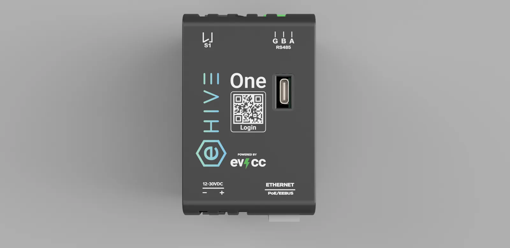
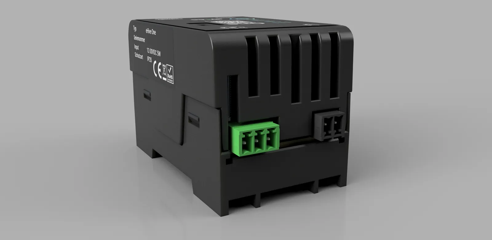

# Anschlüsse & Bedienelemente

## Übersicht

Die folgenden Fotoansichten zeigen die Position der Schnittstellen am Gerät.

### QR mit USB-C

### Ethernet + Versorgung + NetMode-Taster

### RJ45, 12-30 V DC, NetMode Taster + LED

Die folgenden Anschlüsse/Funktionen sind für die Standardausführung vorgesehen.

| Bereich | Element | Zweck / Hinweis |
|---|---|---|
| Versorgung | **12–30 V DC** (Schraub-/Push‑In‑Klemme) | Kleinspannungsversorgung, Polung gemäß Beschriftung am Gerät |
| Netzwerk | **RJ45 Ethernet (Gigabit)** | Netzwerkzugang; optional mit PoE |
| USB | **USB‑C** | Erweiterungen (z. B. WLAN‑Stick, USB‑Peripherie); je nach System auch Service/Diagnose |
| Feldbus | **RS485** | Serielle Schnittstelle für Feld-/Zähler-/Gateway‑Anbindungen. **Klemmenbelegung: G (GND), B, A** |
| Digitaleingang | **DI (EnWG §14a)** | Digitaler Eingang für ein Steuersignal (nicht galvanisch getrennt). Es muss ein Relaiskontakt verwendet werden |

## RS485

- Klemmen: **G (GND)**, **B**, **A**
- Verwendung: Integrationsabhängig (z. B. Zähler/Gateway/Feldbus‑Anbindungen)
- Hardware-Prinzip: TTL-UART zu RS485, halbduplex, mit automatischer Richtungsumschaltung.
- Es ist keine separate DE/RE-Steuerleitung vorgesehen. Software nutzt nur TX, RX und GND.
- Interner UART-Default für Projekt-/Servicetests: `/dev/ttyS2`, typischer Modbus-RTU-Test mit `9600 8N1`.
- Abschlusswiderstand: 120 Ohm nur an den beiden Bus-Enden aktivieren. Bei kurzen Einzeltests kann der Abschluss je nach Gegenstelle entfallen.
- Empfehlung: verdrilltes A/B-Paar verwenden und GND als Bezug mitführen, besonders bei längeren Leitungen oder separaten Versorgungen.

## Digitaler Eingang (EnWG §14a)

- Eingangssignal: Steuersignal
- Hinweis: Der Eingang ist **nicht potentialfrei**. Es muss ein Relaiskontakt verwendet werden.

## Taster

- **Reset/NetMode‑Taster:** unterhalb der RJ45‑Buchse.
  - Funktion: Netzwerk und Passwort‑Recovery (`5 s` DHCP / `10 s` Default‑IP) → siehe *Software → NetMode*.
  - Position siehe Foto: *Ethernet + Versorgung + NetMode-Taster*.

## LEDs

- **NetMode‑LED (rot):** befindet sich unterhalb der RJ45‑Buchse und zeigt den Netzwerk‑Recovery‑Modus an.
- **System‑LED (grün):** befindet sich nahe USB‑C und leuchtet während des Reboots nach NetMode dauerhaft.
- **DI‑LED (EnWG §14a):** zeigt den Status des digitalen Eingangs an.

## Versorgungsempfehlung

- Netzteil: **mindestens 15 W**
- Absicherung: gemäß verwendetem **Netzteil** und Installation durch Elektrofachkraft
