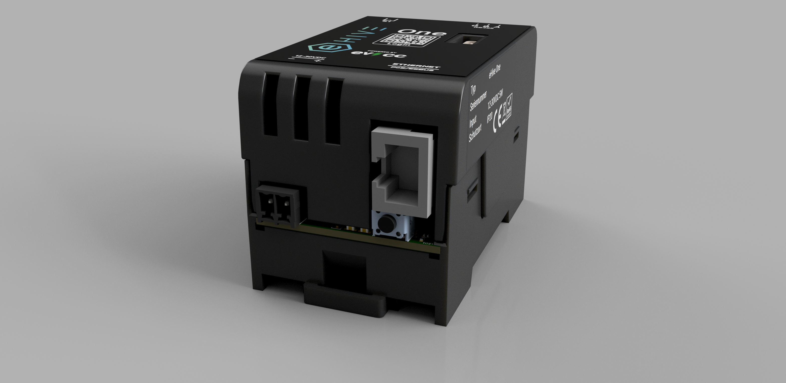

# LEDs & Taster

## NetMode‑Taster

- Position: **unterhalb der RJ45‑Buchse**.
- Zweck: Netzwerk‑ und Passwort‑Recovery (`5 s` DHCP / `10 s` Default‑IP).
- Hinweis: NetMode setzt bei beiden Aktionen die Zugangspasswörter zurück und startet das Gerät neu.

Details siehe *Software → NetMode (Netzwerk‑Taster)*.

## NetMode‑LED

Die grüne NetMode‑LED signalisiert den Netzwerk‑Recovery‑Modus:

- **Taster unter 5 s gehalten:** LED leuchtet dauerhaft.
- **Taster 5 s bis unter 10 s gehalten:** LED aus.
- **Taster ab 10 s gehalten:** LED blinkt schnell.
- **Neustart nach NetMode:** LED leuchtet dauerhaft; der Ablauf dauert ca. 1 Minute.

Nach abgeschlossenem Start zeigt die LED den aktiven Netzwerkmodus an:

- **DHCP:** LED blinkt.
- **Default‑IP:** LED leuchtet dauerhaft.

## DI‑LED (EnWG §14a)

- Zeigt den Status des digitalen Eingangs (DI) an.

Hintergrund (allgemein): §14a EnWG beschreibt die netzorientierte Steuerung bestimmter Verbrauchseinrichtungen. Informationen dazu z. B. über Bundesnetzagentur/gesetzliche Grundlagen.
