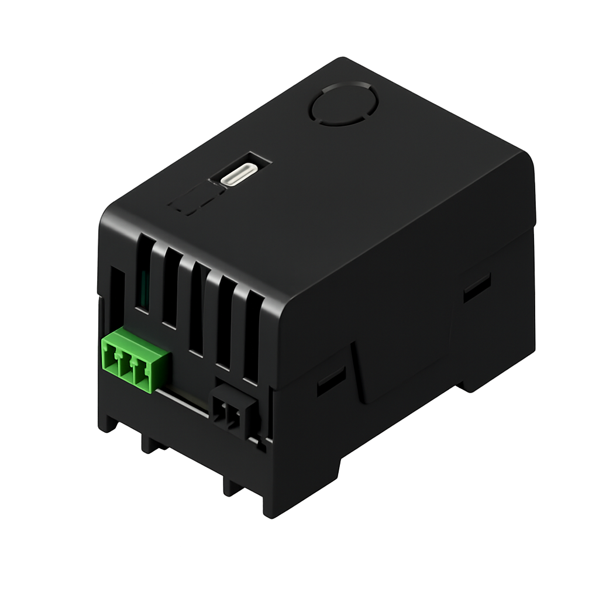
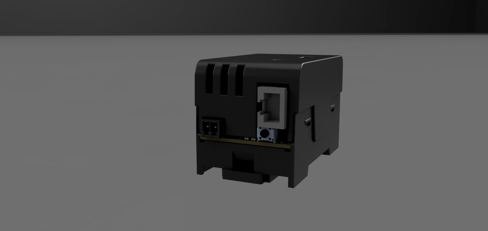

# Gerät – Überblick & Sicherheit

## Produkt

- **Gerätename:** eHive One
- **Hersteller:** Loher ECS (Projekt/Plattform: eHive)
- **Geräteklasse:** Hutschienen-PC für Linux-basierte Dienste (z. B. Energiemonitoring, Remote-Zugriff, Smart‑Home‑Integration)

## Produktansichten

### Gesamtansicht (Render)

### Draufsicht (transparent)

### Anschlussseite oben

### Anschlussseite unten

## Bestimmungsgemäße Verwendung

eHive One ist für den Betrieb in Niederspannungs-Umgebungen vorgesehen und wird üblicherweise im Schaltschrank eingesetzt. Die Software ist auf Bedienung über Weboberflächen ausgelegt.

## Montageumgebung

- **Schutzart:** IP20 → nur in trockener Innenumgebung.
- Vorgesehen für **Schaltschrank / Montage unter Abdeckung**.
- Keine offene Montage ohne Berührungsschutz.
- Installation gemäß geltenden Vorschriften/Normen für Niederspannungsanlagen (z. B. DIN VDE 0100).

## Sicherheitshinweise

- Montage und Verdrahtung nur durch qualifiziertes Personal.
- Vor Arbeiten am Gerät: **Spannung abschalten**.
- Gerät ist **schutzisoliert** und wird mit Kleinspannung betrieben (12–30 V DC).
- Keine Flüssigkeiten, leitfähigen Stäube oder aggressive Atmosphären.
- Für ausreichende Luftzirkulation sorgen.

## Erste Sicherheitsmaßnahmen nach Inbetriebnahme

1. **Admin-Passwort ändern** (SmartHub kann dies automatisch erzwingen).
2. Wenn Remote-Zugriff aktiviert wird: Zugriffsregeln (z. B. Cloudflare Access) prüfen.
3. Updates einspielen (siehe *Wartung → Updates*).
