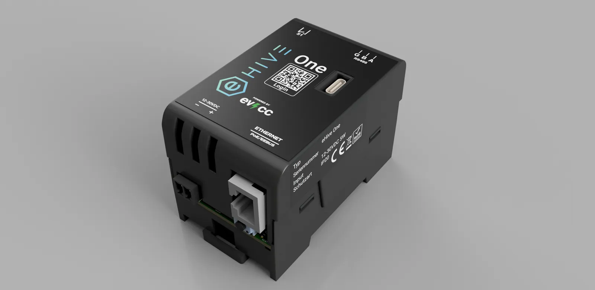

# Gerät - Überblick & Sicherheit

## Produkt

- **Gerätename:** eHive One
- **Hersteller:** Loher ECS (Projekt/Plattform: eHive)
- **Geräteklasse:** Hutschienen-PC für Linux-basierte Dienste (z. B. Energiemonitoring, Remote-Zugriff, Smart-Home-Integration)
- **Speicher:** Im eHive One werden ausschließlich hochwertige SLC-Speicher verwendet, ausgelegt für bis zu **100.000 Schreib-/Lesezyklen** sowie einen Speicher-Komponententemperaturbereich von **-40 °C bis +85 °C**. Diese Angabe ersetzt nicht die zulässige Umgebungstemperatur im Schaltschrank.

## Produktansichten

### Gesamtansicht

### QR mit USB-C

### RJ45, 12-30 V DC, NetMode Taster + LED

### RS485 + DI

Hinweis: Detaillierte Klemmen- und Tasterbeschreibung siehe *Gerät -> Anschlüsse und Bedienelemente*.

## Bestimmungsgemäße Verwendung

eHive One ist für den Betrieb in Niederspannungs-Umgebungen vorgesehen und wird üblicherweise im Schaltschrank eingesetzt.

## Montageumgebung

- **Schutzart:** IP20 -> nur in trockener Innenumgebung.
- Vorgesehen für **Schaltschrank / Montage unter Abdeckung**.
- Keine offene Montage ohne Berührungsschutz.
- Installation gemäß geltenden Vorschriften/Normen für Niederspannungsanlagen (z. B. DIN VDE 0100).

## Montage und Wärmeabfuhr

eHive One ist passiv gekühlt. Für dauerhaften Betrieb muss der Schaltschrank so aufgebaut sein, dass die Wärme frei abziehen kann.

- Lüftungsschlitze am Gerät dürfen nicht verdeckt oder durch Kabel, Kabelkanäle, Abdeckungen oder benachbarte Geräte blockiert werden.
- Oberhalb und unterhalb des Geräts muss ein freier Luftweg vorhanden sein. Als interne Planungsvorgabe mindestens **20 mm** frei lassen; bei dichter Bestückung, warmem Schrank oder hoher Dauerlast mehr Abstand vorsehen.
- Wärmequellen wie Netzteile, Relais, Schütze, Leistungsschalter, Wechselrichter, Ladeelektronik oder Heizungen nicht direkt über, unter oder unmittelbar neben dem Gerät platzieren.
- Erwärmte Abluft anderer Komponenten darf nicht direkt in die Lüftungsschlitze des eHive One steigen.
- Die Temperatur ist am Montageort im Schaltschrank zu bewerten, nicht nur anhand der Raumtemperatur.
- Ohne gesonderten thermischen Nachweis gilt als Planungsgrenze für den Schrank-Innenraum am eHive-Montageort: **max. 40 °C**, über 24 h im Mittel **max. 35 °C**.
- Bei höheren Temperaturen sind Schaltschrankauslegung, Derating, Lüftung/Kühlung und die Eignung aller eingebauten Komponenten durch eine Elektrofachkraft separat zu prüfen.

Normhinweis: IEC/DIN EN IEC 61439 behandelt für Niederspannungs-Schaltgerätekombinationen normale Betriebsbedingungen, Temperaturerhöhung und Verifikation. Die konkrete Auslegung des Schaltschranks bleibt Verantwortung des Schaltanlagenbauers bzw. der Elektrofachkraft. Maßgeblich ist die jeweils gültige Normausgabe und die Dokumentation der verbauten Komponenten.

## Sicherheitshinweise

- Montage und Verdrahtung nur durch qualifiziertes Personal.
- Vor Arbeiten am Gerät: **Spannung abschalten**.
- Gerät ist **schutzisoliert** und wird mit Kleinspannung betrieben (12-30 V DC).
- Keine Flüssigkeiten, leitfähigen Stäube oder aggressive Atmosphären.
- Für ausreichende Luftzirkulation sorgen.

## Erste Sicherheitsmaßnahmen nach Inbetriebnahme

1. **Admin-Passwort ändern** (SmartHub kann dies automatisch erzwingen).
2. Wenn Remote-Zugriff aktiviert wird: Zugriffsregeln (z. B. Cloudflare Access) prüfen.
3. Updates einspielen (siehe *Wartung -> Updates*).
