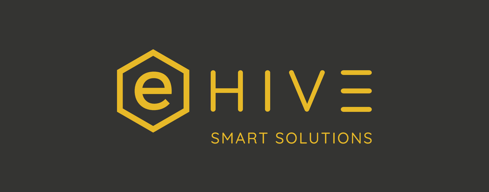

  <h1>eHive One Dokumentation</h1>
  
Wie im Shop aufgebaut: links Rubrik, rechts die kurze Erklaerung.

{ width=220 }

## Rubriken

  

    
<a href="getting-started/">Erste Schritte</a>

    
Inbetriebnahme, Zugriff und erster Login fuer einen schnellen Start.

  

  

    
<a href="hardware/overview/">Geraet</a>

    
Ueberblick, Anschluesse, LEDs, Taster und technische Daten.

  

  

    
<a href="software/smarthub/">Software</a>

    
SmartHub, WattRadar, ioManager, Tunnel Manager und NetMode im Betrieb.

  

  

    
<a href="maintenance/updates/">Wartung</a>

    
Updates, Backup, Restore und Troubleshooting fuer den Servicealltag.

  

  

    
<a href="legal/safety/">Rechtliches</a>

    
Hinweise zu Sicherheit, Haftung und Konformitaet.

  

  

    
<a href="faq/">FAQ</a>

    
Direkte Antworten auf die haeufigsten Fragen im Betrieb.

  

## Schnellstart

1. Geraet auf Hutschiene montieren (Einbau im geschlossenen Schaltschrank oder unter Abdeckung, IP20).
2. Versorgung anschliessen (12-30 V DC ueber Klemme oder optional PoE, je nach Variante).
3. Netzwerk verbinden.
4. Im Browser oeffnen:
   - `http://ehiveone.local/` (mDNS)
   - oder `http://<IP-ADRESSE>/`
5. Login (Standard):
   - Benutzer: `admin`
   - Passwort: `ehive`

> Es wird nur HTTP bereitgestellt (kein HTTPS). Zugangsdaten nach der Inbetriebnahme aendern.

## Support

- Kontakt: `support-eHive@gmx.de`
