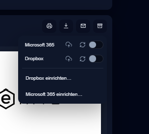

# chargeLedger

Mit chargeLedger wertest und dokumentierst du Ladevorgänge je Fahrzeug und Monat. Die App liest Ladedaten aus evcc, berechnet die Kosten nach dem gewählten Modell und erzeugt ein PDF für die Monatsabrechnung.

Dokumentierter Softwarestand: **chargeLedger 0.2.39**

## Zugriff

- SmartHub öffnen.
- In der App-Liste **chargeLedger** auswählen.
- Falls die App nicht sichtbar ist, im SmartHub App Store prüfen, ob sie installiert und gestartet ist.

## Typische Nutzung

1. chargeLedger über SmartHub öffnen.
2. Fahrzeug auswählen.
3. Monat auswählen.
4. Fahrer/Name, Kennzeichen und km-Stand prüfen oder ergänzen.
5. Abrechnungsmodell prüfen: evcc-Tarif, PV-/Einspeisetarif oder Strompreispauschale.
6. PDF-Vorschau prüfen.
7. PDF herunterladen, drucken, per Mail senden oder archivieren.

## Datenbasis

chargeLedger verwendet die lokal verfügbaren evcc-Daten. Die Ladevorgänge kommen aus der evcc-Datenbank. Tarife, Tarifzonen, Netzentgelte und Einspeisevergütung müssen in evcc bzw. in der zugrunde liegenden Konfiguration gepflegt sein.

Für die anteilige Grundgebühr liest chargeLedger den Monats-Gesamtverbrauch aus evcc Metrics. Dabei werden `home.*.energy.Wh` und `loadpoint.*.energy.Wh` summiert. Der Wert entspricht dem Gesamtverbrauch aus Haus und Ladepunkten, unabhängig davon, ob die Energie aus Netz, PV oder Batterie stammt.

## Berechnungsmodelle

### evcc-Tarif ohne PV-Mix

Dieses Modell verwendet den in evcc hinterlegten Netzstromtarif.

- Formel: `geladene kWh × Netz-Arbeitspreis`
- Wenn evcc Tarifzonen liefert, wird der Preis zeitanteilig berechnet.
- Wenn evcc Netzentgelte liefert, werden sie auf den Arbeitspreis addiert.
- Eine monatliche Grundgebühr kann anteilig berücksichtigt werden.

Die Grundgebühr wird so aufgeteilt:

```text
Grundgebühr-Anteil =
monatliche Grundgebühr × Lade-kWh / Gesamtverbrauch kWh im Monat
```

### PV-/Einspeisetarif

Dieses Modell ist für Anlagen gedacht, bei denen ein Teil der Ladung aus PV oder Batterie stammt. chargeLedger verwendet den Netzanteil und den PV-/Batterieanteil getrennt.

- Netzanteil: `Netz-kWh × (Netztarif + Netzentgelt)`
- PV-/Batterieanteil: `PV-/Batterie-kWh × Einspeisetarif`
- Wenn evcc bereits Sessionkosten liefert, haben diese Vorrang.
- Die Grundgebühr wird in diesem Modell aktuell auf den Netzanteil bezogen und gegen den Monats-Gesamtverbrauch aus evcc verteilt.

Dieses Modell eignet sich, wenn der Arbeitgeber nicht die tatsächliche entgangene Einspeisevergütung sehen soll, sondern eine nachvollziehbare, konfigurierbare Mischkalkulation erwartet. Die fachliche Freigabe durch Arbeitgeber, Steuerberatung oder Buchhaltung bleibt erforderlich.

### Strompreispauschale

Die Strompreispauschale verwendet einen pauschalen kWh-Wert aus der Destatis/BMF-Logik. In diesem Modell wird keine separate Grundgebühr addiert, weil der Pauschalwert als Gesamtpreis je kWh verstanden wird.

- Formel: `geladene kWh × Strompreispauschale`
- Der Link in der App führt zur Destatis-Tabelle.
- Für Folgejahre wird der relevante Wert aus der jeweils gültigen Tabelle bzw. BMF-Vorgabe verwendet.

### evcc-Sessionkosten

Wenn evcc für eine Ladesession bereits tatsächliche Sessionkosten liefert, nutzt chargeLedger diesen Betrag vorrangig. Das ist sinnvoll, wenn evcc bereits dynamische Tarife, Hoch-/Niedertarif oder andere Bestandteile korrekt zusammengeführt hat.

### Zeitabhängige Tarife

chargeLedger kann Tarifzonen zeitanteilig berechnen. Ein Ladevorgang, der von Hoch- in Niedertarif läuft, wird nach Daueranteilen gewichtet. Ab Version `0.2.39` sind auch Zeitfenster über Mitternacht, z. B. `22-06`, abgesichert und unit-getestet.

## Rechtlich wichtige Hinweise

!!! warning "Keine Rechts- oder Steuerberatung"
    chargeLedger erzeugt technische Abrechnungsunterlagen. Betreiber, Arbeitgeber, Steuerberatung oder Buchhaltung müssen prüfen, ob die Auswertung im konkreten Fall verwendet werden darf.

Wichtige Punkte:

- Dieses PDF darf für abrechnungsrelevante Firmenwagenabrechnungen nur verwendet werden, wenn die Messwerte von einem geeigneten MID-Zähler oder einer Wallbox mit MID-Zähler stammen.
- Der Begriff MID bezieht sich auf die EU-Messgeräterichtlinie 2014/32/EU. Für Elektrizitätszähler ist insbesondere Anhang V / MI-003 relevant.
- In Deutschland sind zusätzlich Mess- und Eichrecht, insbesondere MessEG und MessEV, zu beachten.
- Die steuerliche Behandlung von Ladevorgängen, Arbeitgebererstattung, steuerfreiem Laden beim Arbeitgeber und Auslagenersatz kann vom Einzelfall abhängen.
- Bei privatem Laden eines Dienstwagens sollten tatsächliche Kosten, Pauschalen, Arbeitgebervorgaben und Nachweispflichten vor produktiver Nutzung abgestimmt werden.
- Für selbst getragene häusliche Stromkosten eines betrieblichen Elektrofahrzeugs verlangt das BMF einen Nachweis der Strommenge über einen gesonderten stationären oder mobilen Zähler, z. B. Wallbox- oder fahrzeuginternen Stromzähler.
- Maßgeblich ist laut BMF in der Regel der individuelle Strompreis des Stromvertrags. Neben dem Arbeitspreis je kWh ist auch ein Grundpreis anteilig zu berücksichtigen; ein bloßer Eigenbeleg für den individuellen Strompreis ist nicht zulässig.
- Bei dynamischen Stromtarifen kann nach BMF der durchschnittliche monatliche Strompreis je kWh inklusive anteiligem Grundpreis verwendet werden.
- Bei privater PV-Anlage bestehen nach BMF keine Bedenken, für die Ermittlung häuslicher Stromkosten auf den vertraglichen Haushaltsstromtarif inklusive anteiligem Grundpreis abzustellen.
- Die Strompreispauschale ist laut BMF als Vereinfachung für den Zeitraum 1. Januar 2026 bis 31. Dezember 2030 vorgesehen und kann auch bei dynamischem Tarif oder privater PV genutzt werden.
- Grundgebühren dürfen nur dann angesetzt werden, wenn das gewählte Modell und die Abrechnungsfreigabe das tragen. Bei Verwendung der Strompreispauschale wird die Grundgebühr in chargeLedger nicht zusätzlich addiert.
- Kilometerstand, Fahrzeugzuordnung, Monat, Zählerstände und Tarife müssen vor Weitergabe des PDFs plausibilisiert werden.

Quellen zur Einordnung:

- [MessEG - Mess- und Eichgesetz](https://www.gesetze-im-internet.de/messeg/)
- [MessEV - Mess- und Eichverordnung](https://www.gesetze-im-internet.de/messev/)
- [EU-Richtlinie 2014/32/EU über Messgeräte](https://eur-lex.europa.eu/legal-content/DE/TXT/?uri=CELEX:32014L0032)
- [EStG § 3, u. a. Nr. 46 zu Vorteilen für Elektrofahrzeuge](https://www.gesetze-im-internet.de/estg/__3.html)
- [BMF-Schreiben zu selbst getragenen Stromkosten für Elektrofahrzeuge](https://www.bundesfinanzministerium.de/Content/DE/Downloads/BMF_Schreiben/Steuerarten/Lohnsteuer/2025-11-11-selbst-getragenen-stromkosten.pdf?__blob=publicationFile&v=3)
- [Destatis GENESIS-Tabelle 61243-0001](https://www-genesis.destatis.de/datenbank/online/statistic/61243/table/61243-0001)

## Archiv

chargeLedger kann erzeugte PDF-Abrechnungen direkt aus der PDF-Vorschau heraus archivieren. Das Archiv-Menü sitzt rechts oben neben Drucken, Download und E-Mail.

Neue Funktionen:

- **Microsoft 365 Upload:** Der Button **Microsoft 365** startet den manuellen Upload der aktuell angezeigten PDF-Abrechnung. Das Cloud-Symbol im Button kennzeichnet die Upload-Aktion.
- **Dropbox Upload:** Der Button **Dropbox** lädt die aktuelle PDF manuell in das verbundene Dropbox-Ziel hoch.
- **Automatischer Upload:** Das Automatik-Symbol mit Schiebeschalter aktiviert den monatlichen Upload für das jeweilige Ziel. Der Tooltip lautet: `Automatischer Upload am 2ten jedes Monats`.
- **Ziel einrichten:** Über **Dropbox einrichten...** bzw. **Microsoft 365 einrichten...** wird die jeweilige Verbindung vorbereitet oder geändert.

Wichtiges Verhalten:

- Ist Microsoft 365 oder Dropbox noch nicht eingerichtet, öffnet chargeLedger beim manuellen Upload oder beim Aktivieren der Automatik direkt den passenden Einrichtungsdialog.
- Der automatische Upload läuft am 2. eines Monats für den vorherigen Abrechnungsmonat.
- Pro Ziel kann die Automatik getrennt aktiviert werden. Dropbox und Microsoft 365 können also unabhängig voneinander genutzt werden.
- Der Upload verwendet die Daten der PDF-Abrechnung. Vor produktiver Nutzung sollten Fahrzeug, Monat, km-Stand, Zählerstände, Tarif und Summe geprüft werden.



## Tests und Qualitätssicherung

Ab chargeLedger `0.2.39` gibt es Unit-Tests für die wichtigsten Berechnungen.

Geprüfte Fälle:

- Netzpreis, Netzentgelt und anteilige Grundgebühr.
- PV-/Batterie-Mix mit Netzanteil.
- Vorrang von evcc-Sessionkosten.
- Strompreispauschale ohne zusätzliche Grundgebühr.
- Zeitabhängige Tarife über Mitternacht.
- Fehlende Tarife ohne falsche Kosten.
- evcc-Gesamtverbrauch aus Haus- und Ladepunkt-Metrics.

Lokaler Testbefehl im chargeLedger-Repo:

```bash
npm test
```

## Prüfung nach Updates

- App in SmartHub öffnen.
- Fahrzeugliste prüfen.
- PDF-Vorschau für einen bekannten Monat erzeugen.
- Download oder Archiv-Upload testen.
- Zahlenformat, km-Stand, Zählerstände, Tarife und Summen plausibilisieren.
- Bei Tarifänderungen in evcc einen Testmonat gegenrechnen.

## Troubleshooting

- **Keine Fahrzeuge sichtbar:** evcc-Datenbank und Ladevorgänge prüfen.
- **Tarif unvollständig:** evcc-Tarifkonfiguration prüfen.
- **Grundgebühr fehlt:** Strompreispauschale deaktivieren, Grundgebühr eintragen und prüfen, ob evcc Metrics den Monats-Gesamtverbrauch liefern.
- **PDF bleibt leer:** Monat und Fahrzeugauswahl prüfen; testweise einen Zeitraum mit bekannten Ladevorgängen wählen.
- **Archiv funktioniert nicht:** Dropbox- oder Microsoft-365-Ziel einrichten und anschließend Upload erneut auslösen.

## Screenshots

Die Hauptansicht kombiniert Fahrzeug- und Monatsauswahl mit der PDF-Vorschau. Die Aktionen für Drucken, Download, E-Mail und Archivierung sitzen direkt an der Vorschau.


