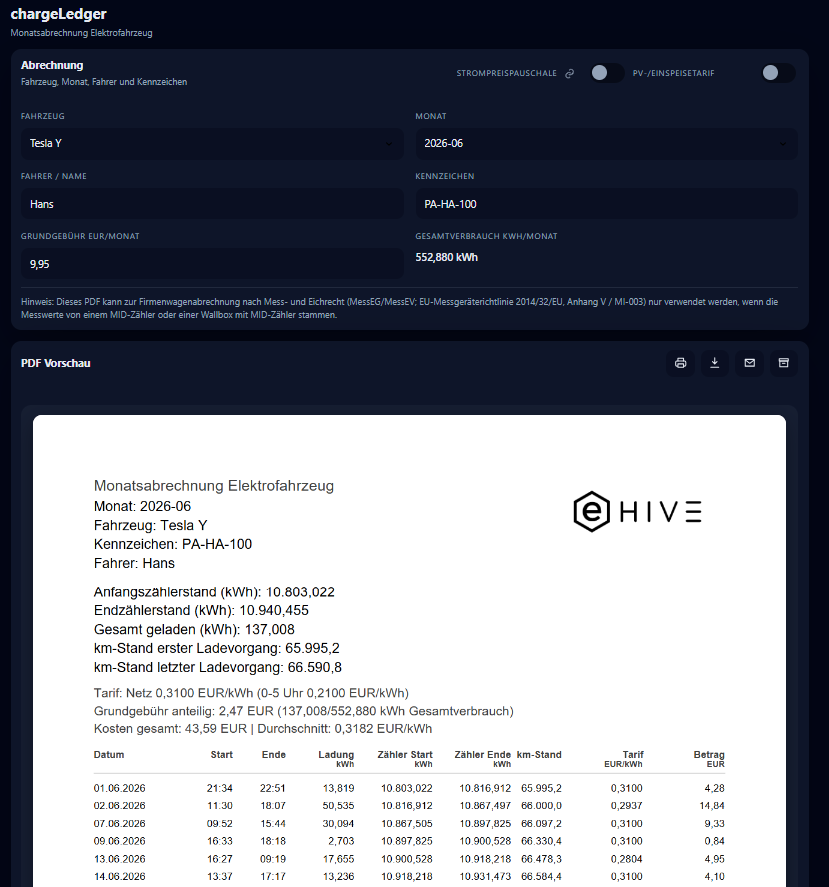

# chargeLedger

Dokumentierter Softwarestand: **chargeLedger 0.2.8**

Mit chargeLedger wertest und dokumentierst du Ladevorgänge je Fahrzeug und Monat. Du nutzt es als technische Abrechnungs- und Dokumentationshilfe.

## Zweck

Du brauchst chargeLedger, wenn du Ladevorgänge je Fahrzeug und Monat nachvollziehbar dokumentieren willst. Damit führst du Fahrzeug- und Monatsauswahl, Stammdatenprüfung und PDF-Erzeugung in einem Ablauf zusammen.

## Zugriff

- SmartHub öffnen.
- In der App-Liste **chargeLedger** auswählen.
- Falls die App nicht sichtbar ist, im SmartHub App Store prüfen, ob sie installiert und gestartet ist.

## Typische Nutzung

1. chargeLedger über SmartHub öffnen.
2. Fahrzeug auswählen.
3. Monat auswählen.
4. Fahrer/Name und Kennzeichen prüfen oder ergänzen.
5. PDF-Vorschau prüfen.
6. PDF herunterladen, drucken, per Mail vorbereiten oder archivieren.

## Funktionen

- Monatsauswertung je Fahrzeug.
- Fahrer- und Kennzeichenangaben.
- PDF-Vorschau im Browser.
- PDF-Download und Druckfunktion.
- Mail-Entwurf bzw. Versandfunktion je nach Konfiguration.
- Archivierung, z. B. über konfigurierte Cloud-/Ablageziele.
- Speicherung fahrzeugbezogener Angaben im Browser für schnellere Wiederverwendung.

## Datenbasis

chargeLedger verwendet die im System verfügbaren Ladedaten. Je nach Auslieferungsstand stammen diese aus evcc bzw. aus den dafür eingerichteten lokalen Datenquellen.

## Wichtige Hinweise

- Die erzeugten PDFs sind eine technische Dokumentationshilfe.
- Rechtliche, steuerliche und abrechnungstechnische Anforderungen müssen vom Betreiber bzw. Inbetriebnehmer geprüft werden.
- Kilometerstände, Fahrzeugzuordnung und Zeiträume müssen vor Verwendung der Auswertung plausibilisiert werden.
- Für Dritt-Datenquellen, fehlerhafte Ausgangsdaten oder falsch gepflegte Fahrzeugdaten wird keine Gewährleistung übernommen.

## Prüfung nach Updates

- App in SmartHub öffnen.
- Fahrzeugliste prüfen.
- PDF-Vorschau für einen bekannten Monat erzeugen.
- Download/Export testen.
- Zahlenformat und Kilometerangaben plausibilisieren.

## Troubleshooting

- **Keine Fahrzeuge sichtbar:** Datenquelle und evcc-Ladevorgänge prüfen.
- **PDF bleibt leer:** Monat und Fahrzeugauswahl prüfen; testweise einen Zeitraum mit bekannten Ladevorgängen wählen.
- **Falsche Stammdaten:** Fahrer, Kennzeichen und Kilometerstand vor dem Export korrigieren.
- **Export funktioniert nicht:** Browser-Popup-Blocker und Download-Berechtigungen prüfen.

## Screenshots

Die Hauptansicht kombiniert Fahrzeug- und Monatsauswahl mit der PDF-Vorschau. Die Aktionen für Drucken, Download, E-Mail und Archivierung sitzen direkt an der Vorschau.

Die Ansicht unterstützt den normalen Abrechnungsablauf: Fahrzeug und Monat auswählen, Fahrer- und Kennzeichendaten prüfen, PDF-Vorschau kontrollieren und die Monatsabrechnung anschließend exportieren oder weitergeben.

