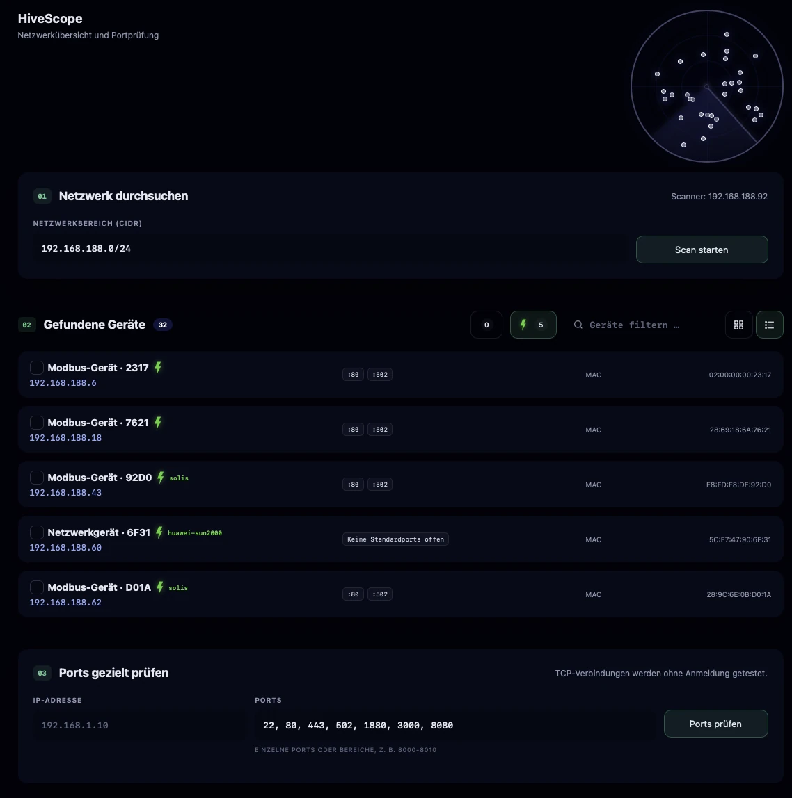

# HiveScope

Mit HiveScope verschaffst du dir einen Überblick über Geräte im lokalen Netzwerk. Die App sucht erreichbare IPv4-Geräte, sammelt verfügbare Geräteinformationen, zeigt offene Standarddienste und unterstützt bei der Suche nach möglicher evcc-kompatibler Hardware.

Dokumentierter Softwarestand: **HiveScope 1.3.5**

## Zugriff

- SmartHub öffnen.
- In der App-Liste **HiveScope** auswählen.
- Falls die App nicht sichtbar ist, im SmartHub App Store prüfen, ob sie installiert und gestartet ist.

HiveScope läuft lokal auf eHive One. Eine direkte Anmeldung an den gefundenen Geräten findet nicht statt.

## Typische Nutzung

1. HiveScope über SmartHub öffnen.
2. Den vorgeschlagenen Netzwerkbereich prüfen.
3. **Scan starten** auswählen.
4. Warten, bis alle Adressen geprüft wurden.
5. Gefundene Geräte in der Raster- oder Listenansicht untersuchen.
6. Bei Bedarf nach Geräten suchen, Geräte markieren oder den EVCC-Filter aktivieren.
7. Für eine gezielte Prüfung IP-Adresse und TCP-Ports unter **Ports gezielt prüfen** eintragen.

## Netzwerk durchsuchen

HiveScope schlägt den lokalen IPv4-Netzwerkbereich in CIDR-Schreibweise vor, beispielsweise:

```text
192.168.1.0/24
```

Ein `/24`-Netz enthält bis zu 254 nutzbare Geräteadressen. Während des Scans zeigt die Fortschrittsanzeige, wie viele Adressen bereits geprüft und wie viele Geräte gefunden wurden. Im Radar erscheint für jeden Fund ein Punkt; neue Treffer leuchten kurz stärker auf.

HiveScope kann – abhängig von Gerät und Netzwerk – folgende Informationen anzeigen:

- IP-Adresse
- Hostname oder abgeleitete Gerätebezeichnung
- MAC-Adresse
- Hersteller aus der MAC-Herstellerdatenbank
- erreichbare Standardports und zugehörige Dienste
- mögliche Modbus-Gerätekennung
- mögliche Zuordnung zu einem evcc-Template

Wenn ein Gerät keinen Hostnamen oder Hersteller meldet, erzeugt HiveScope aus den verfügbaren Hinweisen eine neutrale Bezeichnung, beispielsweise **Netzwerkgerät** oder **Modbus-Gerät**.

## Geräteübersicht und Filter

Über die Schaltflächen rechts oberhalb der Treffer wechselst du zwischen Raster- und Listenansicht.

Weitere Möglichkeiten:

- **Textsuche:** filtert unter anderem nach IP-Adresse, Hostname, MAC-Adresse und Hersteller.
- **Auswahl:** Über den Haken am Gerät lassen sich einzelne Treffer markieren. Der Auswahlfilter zeigt anschließend nur die markierten Geräte.
- **EVCC-Blitz:** zeigt nur Geräte, für die HiveScope einen möglichen evcc-Hinweis gefunden hat.
- **Gerätedetails:** Ein Klick auf einen Treffer öffnet Details zu Adresse, Hersteller, Ports, Modbus und EVCC-Einschätzung.

Der letzte Scan, die Auswahl, Filter und Ansichtsart werden im Browser gespeichert. Nach dem Neuladen der Seite bleibt die zuletzt aufgebaute Übersicht deshalb sichtbar. Browserdaten sind lokal an Browser und Endgerät gebunden; beim Löschen der Website-Daten geht die gespeicherte Ansicht verloren.

## Ports gezielt prüfen

Mit **Ports gezielt prüfen** testest du, ob bestimmte TCP-Ports eines Geräts erreichbar sind. Einzelne Ports und Bereiche können kombiniert werden, zum Beispiel:

```text
22, 80, 443, 502, 1880, 3000, 8080
```

Typische Zuordnungen sind:

| Port | Typischer Dienst |
| --- | --- |
| 22 | SSH |
| 80 | HTTP |
| 443 | HTTPS |
| 502 | Modbus TCP |
| 1880 | Node-RED |
| 3000 / 3003 | Web-App |
| 8080 | alternativer HTTP-Dienst |

Ein offener Port bestätigt zunächst nur, dass eine TCP-Verbindung angenommen wird. Er beweist nicht, dass der vermutete Dienst vollständig eingerichtet, ohne Anmeldung nutzbar oder mit einer bestimmten Anwendung kompatibel ist.

## EVCC-Kandidaten und Templates

Ein grüner Blitz markiert ein Gerät, wenn Name, Hersteller, Web-Hinweis oder erreichbarer Dienst zu einem bekannten evcc-Gerätetyp passen könnte. Wenn die Hinweise konkret genug sind, zeigt HiveScope neben dem Blitz ein mögliches Template an, beispielsweise:

- `solis`
- `huawei-sun2000`

!!! info "Vorauswahl statt Kompatibilitätszusage"
    Der Blitz ist eine technische Einschätzung. Ein Treffer bedeutet nicht automatisch, dass Modell, Firmware, Schnittstelle und Zugangsdaten mit evcc kompatibel sind. Die tatsächliche Funktion muss bei der evcc-Einrichtung geprüft werden.

Port 502 allein ist ein Hinweis auf Modbus TCP, aber noch kein eindeutiger Beleg für ein bestimmtes Energiesystem. Hersteller- und Geräteinformationen erhöhen die Aussagekraft.

## Modbus-Gerätekennung

Bei Geräten mit offenem Port 502 versucht HiveScope eine standardisierte, lesende Modbus-Geräteidentifikation. Dabei können Hersteller, Produkt und Revision zurückgegeben werden.

Die Meldung **„Port 502 erkannt, aber keine Gerätekennung geliefert“** bedeutet:

- Der TCP-Port 502 ist erreichbar.
- Das Gerät hat auf die optionale Identifikationsanfrage keine verwertbaren Angaben geliefert.
- Modbus TCP kann trotzdem funktionieren.
- Unit-ID, Modell, Registerbelegung und Zugangsvoraussetzungen müssen gegebenenfalls separat ermittelt werden.

HiveScope liest bei dieser Erkennung keine Betriebsregister aus und verändert keine Gerätekonfiguration.

## Sicherheit und Grenzen

- HiveScope akzeptiert nur private IPv4-Netzwerke.
- Ein Scan ist auf höchstens 1024 Adressen begrenzt.
- Eine gezielte Prüfung umfasst höchstens 128 TCP-Ports.
- Es werden keine Zugangsdaten ausprobiert.
- HiveScope führt keine Exploit-, Passwort- oder UDP-Scans aus.
- Offene Ports und Geräteinformationen können sich durch Firewalls, VLANs, WLAN-Isolation oder Energiesparzustände ändern.

!!! warning "Nur im eigenen Netzwerk einsetzen"
    Scanne ausschließlich Netzwerke und Geräte, für die du eine Berechtigung hast. Ein Netzwerkscan kann von Firewalls oder Überwachungssystemen protokolliert werden.

## Prüfung nach Updates

- HiveScope aus SmartHub öffnen.
- Prüfen, ob der lokale Netzwerkbereich korrekt vorgeschlagen wird.
- Einen vollständigen Scan ausführen.
- Zwischen Raster- und Listenansicht wechseln.
- Auswahl-, Text- und EVCC-Filter testen.
- Detailansicht eines bekannten Geräts öffnen.
- Einen bekannten offenen und einen geschlossenen TCP-Port vergleichen.
- Seite neu laden und prüfen, ob der letzte Scan erhalten bleibt.

## Troubleshooting

- **Keine Geräte gefunden:** Netzwerkbereich prüfen und sicherstellen, dass eHive One mit dem gewünschten LAN verbunden ist. VLANs und Client-Isolation können Erkennung verhindern.
- **Gerät fehlt:** Das Gerät einschalten, Energiesparmodus prüfen und Scan erneut starten. Manche Geräte antworten nicht auf alle Erkennungsmethoden.
- **Gerät bleibt unbekannt:** Hostname, MAC-Hersteller oder identifizierbarer Dienst wurden nicht geliefert. Die IP-Adresse und offene Ports können trotzdem zur Zuordnung helfen.
- **Hersteller fehlt:** Die MAC-Adresse konnte nicht gelesen werden oder ihr Präfix ist nicht in der lokalen Herstellerdatenbank enthalten.
- **Port wirkt fälschlich geschlossen:** Firewall, Zugriffsbeschränkung, falsche IP-Adresse oder ein nur zeitweise aktiver Dienst können die Ursache sein.
- **Kein EVCC-Blitz:** HiveScope hat keine ausreichenden Hinweise gefunden. Das schließt eine evcc-Kompatibilität nicht aus.
- **Modbus ohne Gerätekennung:** Port 502 ist erreichbar, aber das Gerät unterstützt oder erlaubt die optionale Identifikationsfunktion nicht.
- **Alter Scan fehlt:** Website-Daten oder lokaler Browserspeicher wurden gelöscht oder die App wurde in einem anderen Browser geöffnet.

## Oberfläche

Die Hauptansicht kombiniert Netzwerksuche, animiertes Radar, Gerätefilter und die gezielte Portprüfung. Im Beispiel wurden 32 Geräte gefunden; fünf davon tragen einen EVCC-Hinweis. Erkannte Template-Kandidaten werden direkt neben dem grünen Blitz angezeigt.


