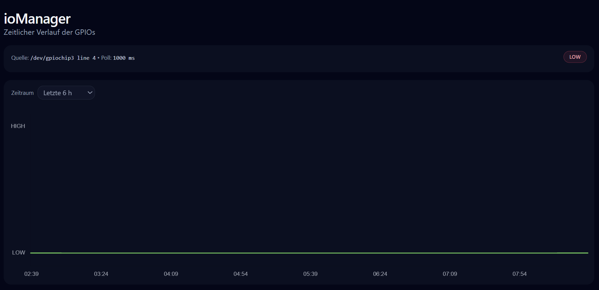

# ioManager

ioManager zeigt den aktuellen Status und den zeitlichen Verlauf eines digitalen Signals (HIGH/LOW). Typische Anwendungsfälle:

- Überwachung eines digitalen Eingangs (z. B. DI für **EnWG §14a**, Relaiskontakt, Statusleitung)
- Diagnose: „Kommt das Signal an?“ / „Wann hat es geschaltet?“

## Oberfläche

- **Status‑Badge:** aktueller Zustand **HIGH** oder **LOW**
- **Polling/Intervall:** wie häufig der Status aktualisiert wird

## Trend‑Diagramm

Wähle den Zeitraum:

- Letzte 1 h / 6 h / 24 h
- Letzte 3 Tage / 7 Tage
- Alle Daten

## Screenshots

