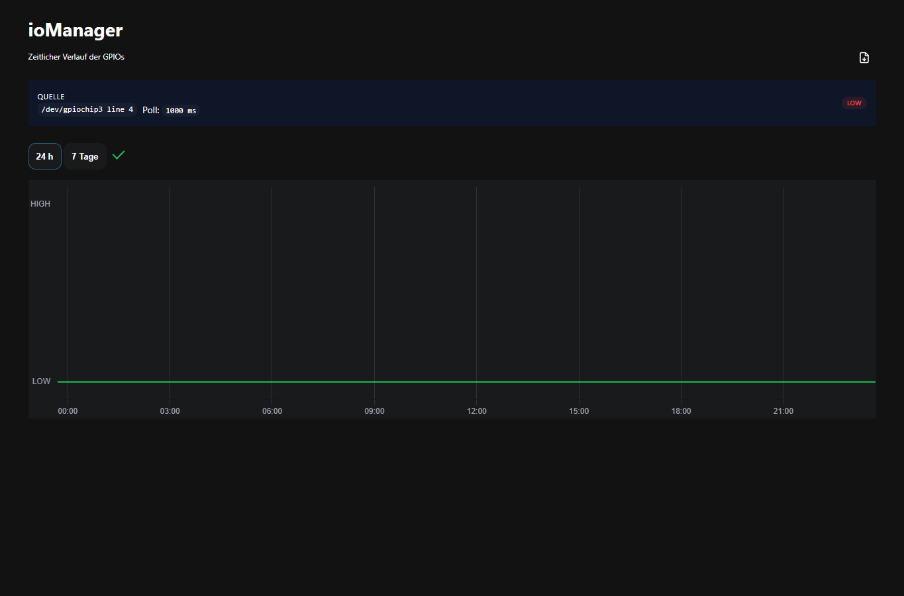

# ioManager

Mit ioManager siehst du den aktuellen Status und den zeitlichen Verlauf eines digitalen Signals (HIGH/LOW). Typische Anwendungsfälle:

- Überwachung eines digitalen Eingangs (z. B. DI für **EnWG §14a**, Relaiskontakt, Statusleitung)
- Diagnose: „Kommt das Signal an?“ / „Wann hat es geschaltet?“

## Zweck

Du brauchst ioManager, wenn du sehen willst, ob ein digitaler Eingang gerade HIGH oder LOW ist und wann sich der Zustand geändert hat. Das hilft dir bei Diagnose, Relaiskontakten und EnWG-14a-Signalen.

## Zugriff

- SmartHub öffnen.
- In der App-Liste **ioManager** auswählen.
- Falls die App nicht sichtbar ist, im SmartHub App Store prüfen, ob sie installiert und gestartet ist.

## Typische Nutzung

1. ioManager öffnen.
2. Aktuellen HIGH/LOW-Status prüfen.
3. Zeitraum auswählen.
4. Signalverlauf mit dem erwarteten Schaltverhalten vergleichen.

## Oberfläche

- **Status‑Badge:** aktueller Zustand **HIGH** oder **LOW**
- **Polling/Intervall:** wie häufig der Status aktualisiert wird

## Trend‑Diagramm

Wähle den Zeitraum:

- Letzte 1 h / 6 h / 24 h
- Letzte 3 Tage / 7 Tage
- Alle Daten

## Prüfung nach Updates

- App in SmartHub öffnen.
- Aktuellen Signalzustand prüfen.
- Zeitraum wechseln und Diagramm neu laden.
- Falls ein Testsignal verfügbar ist, Schaltvorgang auslösen und Verlauf kontrollieren.

## Troubleshooting

- **Status bleibt unverändert:** Verdrahtung, Eingang und erwarteten Pegel prüfen.
- **Diagramm zeigt keine Daten:** Zeitraum vergrößern und App neu laden.
- **Signal wirkt invertiert:** Eingangslogik und angeschlossene Hardware prüfen.

## Screenshots

### Status und Verlauf eines digitalen Signals

Die Ansicht zeigt den aktuellen Signalzustand und ein Verlaufsdiagramm für den gewählten Zeitraum. Über die Zeitfilter lässt sich nachvollziehen, wann ein Eingang geschaltet hat. Das ist hilfreich bei Relaiskontakten, Sperrsignalen, EnWG-14a-Signalen oder allgemeinen digitalen Diagnoseeingängen.

