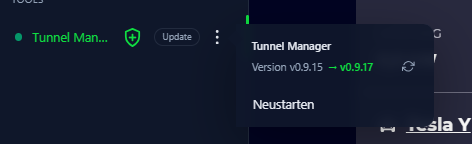
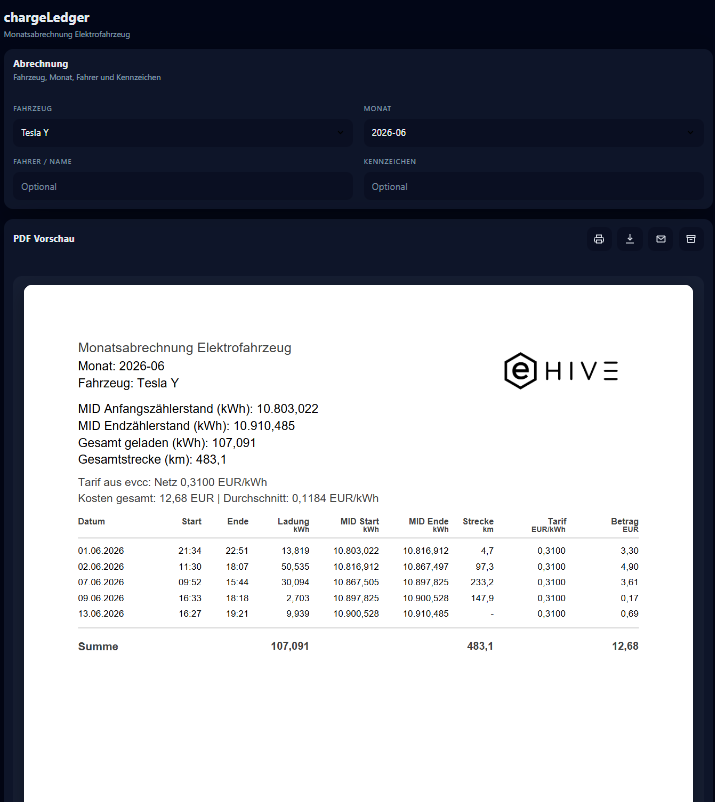
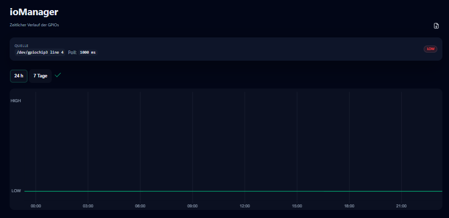
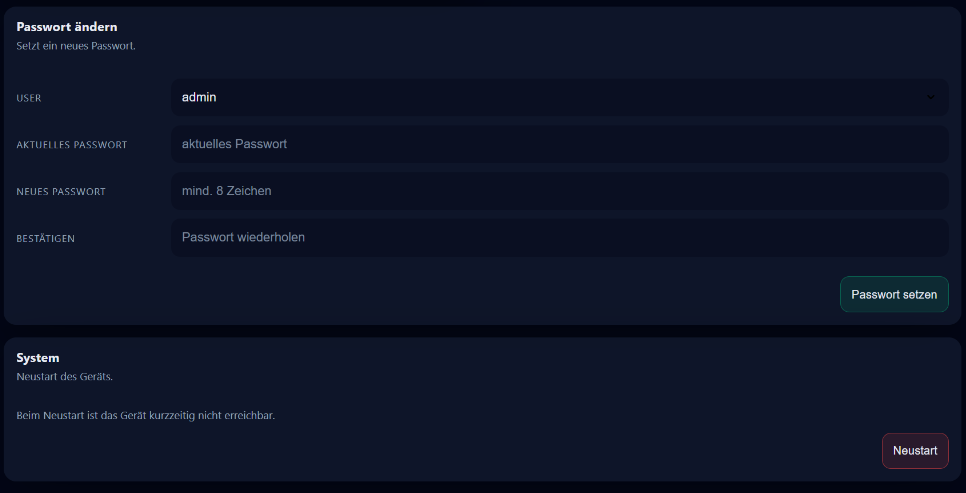
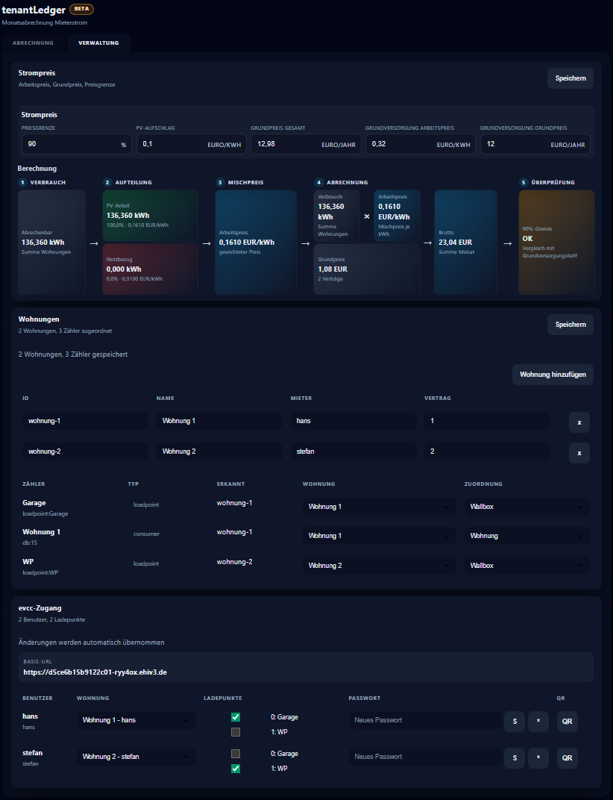
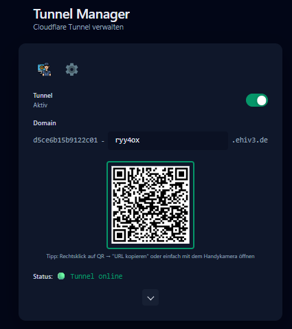
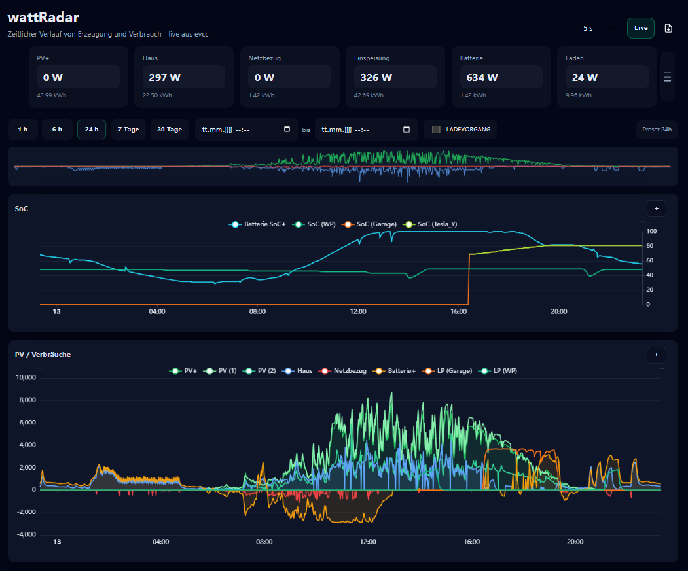
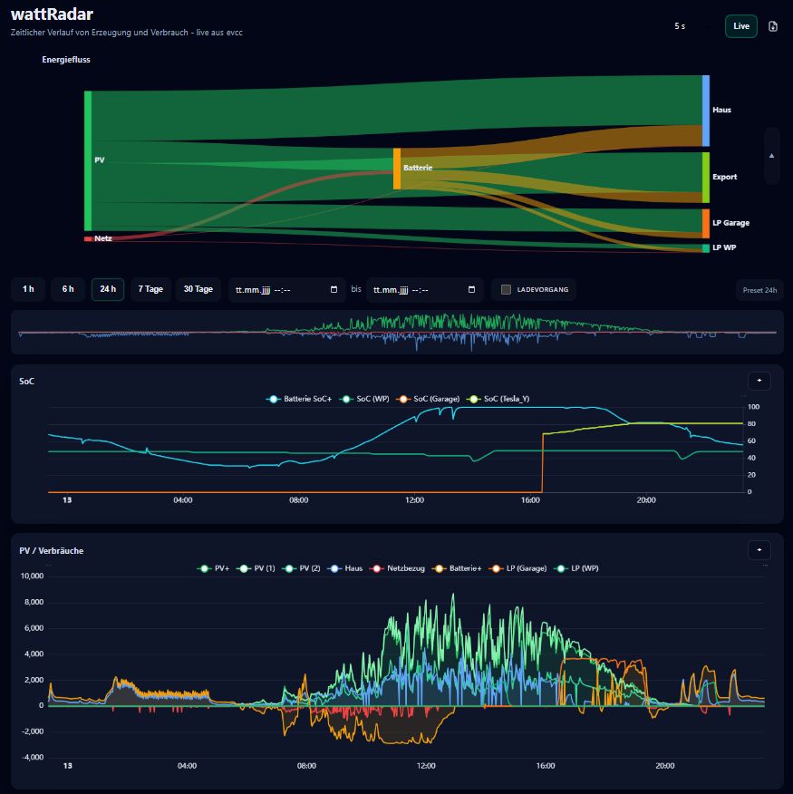

# Screenshot-Galerie

Diese Seite zeigt alle aktuellen PNGs aus dem bereitgestellten Screenshot-Satz. Die Überschriften entsprechen exakt den Bilddateinamen.

## AppStoreInstalliereDeinstallierenNeustarten.png

Beschreibung: SmartHub im App-Store-Kontextmenü. Das Bild zeigt die Aktionen für eine installierte App, insbesondere Neustarten und Deinstallieren.

## AppsUpdaten.png

Beschreibung: SmartHub-App-Menü mit verfügbarer Update-Aktion und Versionshinweis für eine App.

## chargeLedger.png

Beschreibung: chargeLedger mit Monatsabrechnung, Fahrzeugauswahl und PDF-Vorschau für die Ladeabrechnung.

## ioManager.png

Beschreibung: ioManager mit aktuellem Status, Zeitraum-Auswahl und Verlaufsdiagramm für ein digitales Signal.

## LoginFürSettings.png

Beschreibung: SmartHub-Login vor dem Öffnen der geschützten Einstellungen.

## SettingsTeil1.png

Beschreibung: SmartHub-Einstellungen mit Geräte-, Netzwerk- und Remote-Access-Informationen.

## SettingsTeil2.png

Beschreibung: SmartHub-Einstellungen für Passwortänderung und Systemaktionen wie Neustart.

## Systeminformationen.png

Beschreibung: SmartHub-Systeminformationen mit Seriennummer, CPU-, Temperatur- und RAM-Anzeige.

## tenantLedgerAbbrechnung.png

Beschreibung: tenantLedger-Abrechnungsansicht mit Monatsauswertung, Preisfluss und PDF-Vorschau.

## tenantLedgerVerwaltung.png

Beschreibung: tenantLedger-Verwaltungsansicht für Wohnungen, Zählerzuordnung, Rollen und Preisparameter.

## TunnelManager.png

Beschreibung: Tunnel Manager Dashboard mit Tunnelstatus, Domain-Hash, QR-Code und Statusanzeige.

## TunnelManager_PasswortVergabe.png

Beschreibung: Tunnel Manager mit geöffnetem Einstellungsdialog zur Passwortvergabe für den Remote-Zugriff.

## TunnelManager_TemporärerServiceZugang.png

Beschreibung: Tunnel Manager mit Dialog für temporären Service-Zugang, E-Mail-Adresse und Laufzeit.

## wattRadar1.png

Beschreibung: WattRadar-Hauptansicht mit KPI-Kacheln, Zeitfenster, Timeline und Leistungsdiagrammen.

## wattRadar2.png

Beschreibung: WattRadar mit Energiefluss-Diagramm und den zugehörigen Zeitverläufen.

