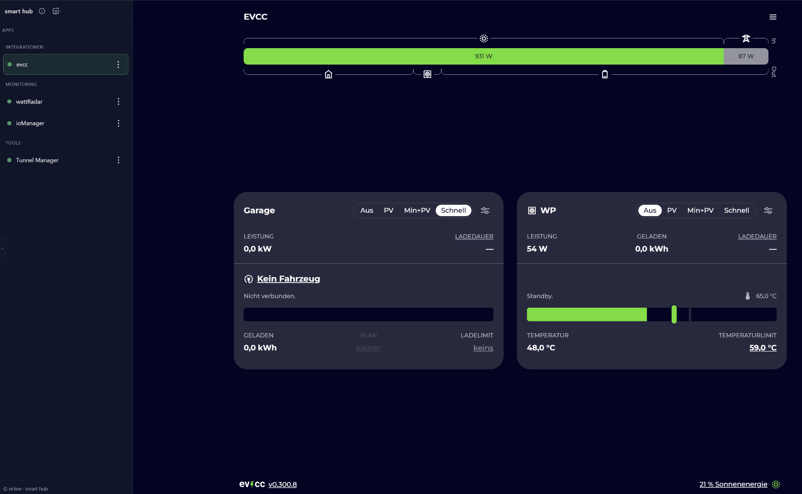
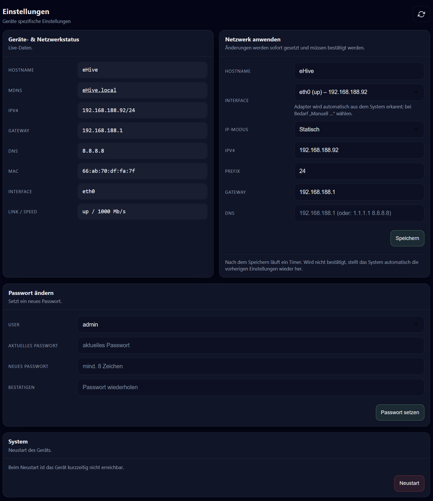

# SmartHub (Dashboard)

SmartHub ist das zentrale Dashboard von eHive One. Es listet verfügbare Apps, zeigt Status und bietet **Einstellungen** für Gerät/Netzwerk.

## Öffnen

- Browser → `http://ehiveone.local/` oder `http://<IP-ADRESSE>/`

## Login (Standard)

- Benutzer: `admin`
- Passwort: `ehive`

Beim ersten Öffnen kann SmartHub das Setzen eines neuen Admin‑Passworts erzwingen.

## Navigation

- Links in der Sidebar: Apps
- Statusanzeige pro App:
  - **on**: erreichbar
  - **off**: nicht erreichbar
  - **update**: Update verfügbar / Update‑Modus

## Einstellungen

SmartHub → **Einstellungen**:

### Geräte‑ & Netzwerkstatus

Zeigt u. a.:

- Hostname (`ehiveone`), mDNS
- IPv4, Gateway, DNS
- Interface, MAC

### Netzwerk ändern

- Hostname setzen
- Interface auswählen
- IP‑Modus: DHCP oder Statisch
- Änderungen werden per Dialog bestätigt (Rollback möglich)

### Passwort ändern

- aktuelles Passwort + neues Passwort (mind. 8 Zeichen empfohlen)

### System

- Neustart über Button (Bestätigung erforderlich)

## Screenshots

