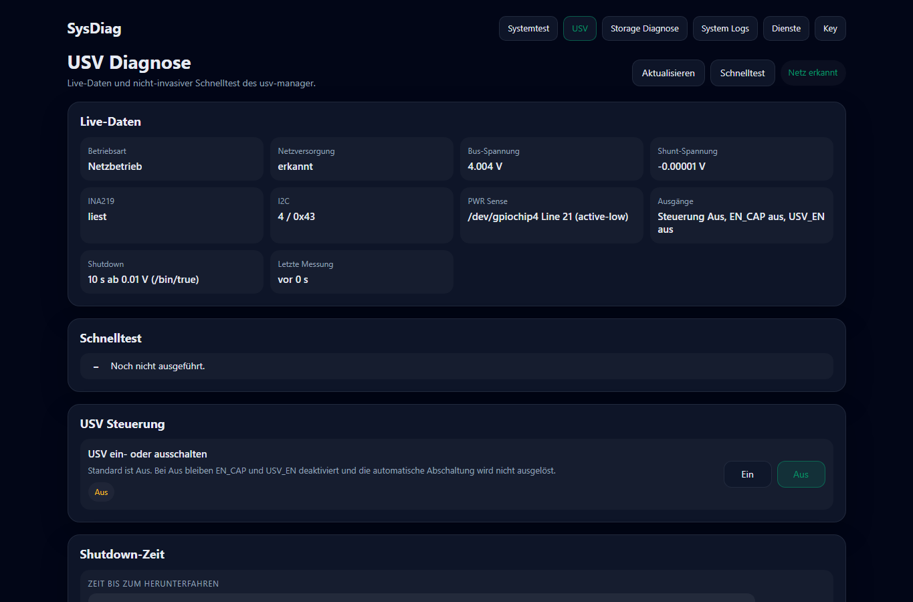

# SmartHub (Dashboard)

SmartHub ist das zentrale Dashboard von eHive One. Es listet verfügbare Apps, zeigt Status und bietet **Einstellungen** für Gerät, Netzwerk, Updates, Backups und Diagnose.

Dokumentierter Softwarestand: **SmartHub 1.1.28**

## Öffnen

- Browser -> `http://ehiveone.local/` oder `http://<IP-ADRESSE>/`

## Login (Standard)

- Benutzer: `admin`
- Passwort: wird bei der Integration geändert bzw. durch das Gerätepasswort ersetzt.

Beim ersten Öffnen kann SmartHub das Setzen eines neuen Admin-Passworts erzwingen.

## Navigation

- Links in der Sidebar: Apps
- Statusanzeige pro App:
  - **on**: erreichbar
  - **off**: nicht erreichbar
  - **update**: Update verfügbar / Update-Modus

## Einstellungen

SmartHub -> **Einstellungen**:

### Geräte- & Netzwerkstatus

Zeigt u. a.:

- Hostname (`ehiveone`), mDNS
- IPv4, Gateway, DNS
- Interface, MAC
- Systeminformationen und Seriennummer

### Netzwerk ändern

- Hostname setzen
- Interface auswählen
- IP-Modus: DHCP oder Statisch
- Änderungen werden per Dialog bestätigt (Rollback möglich)

### Passwort ändern

- aktuelles Passwort + neues Passwort (mind. 8 Zeichen empfohlen)

### System

- Neustart über Button (Bestätigung erforderlich)

### Systemdiagnose

SmartHub stellt Diagnoseansichten bereit:

- `/sysDiag`
- `/sysDiag/usv`

Die USV-Seite zeigt verfügbare USV-Daten, Status, Steuerung und ein kleines Ereignislog. Die USV-Steuerung ist standardmäßig **aus**. Das Feature wird erst aktiv genutzt, wenn Hardware und Verhalten ausreichend getestet und freigegeben sind.

Auf der USV-Seite kann konfiguriert werden:

- USV-Steuerung ein/aus
- Zeit bis zum Herunterfahren bei USV-Ereignis
- aktueller Status und Diagnosewerte
- Ereignislog, wann welche Zustandsänderung erkannt wurde

Hinweis: USV-Funktionalität wird mit SmartHub ausgeliefert, damit neue Geräte nicht separat mit einem zweiten Paket versorgt werden müssen. Bei Geräten ohne USV-Hardware muss die Seite einen deaktivierten bzw. nicht verfügbaren Zustand anzeigen.

### Updates und Wiederherstellung

SmartHub stellt eine Update-/Rettungsoberfläche bereit:

- `http://ehiveone.local/update/`
- `http://<IP-ADRESSE>/update/`
- `http://<IP-ADRESSE>:3003/` als direkter Rettungszugriff

Details: [Updates](../maintenance/updates.md) und [Backup und Wiederherstellung](../maintenance/backup-restore.md).

## Screenshots

