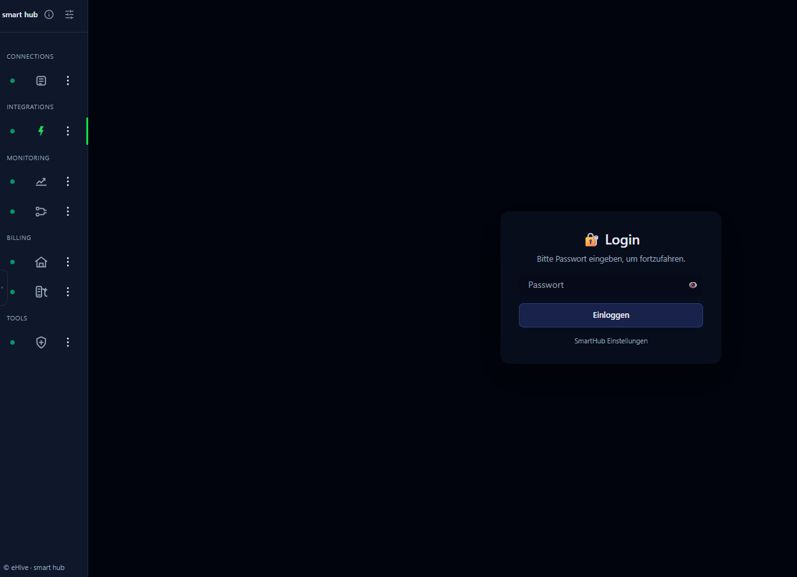
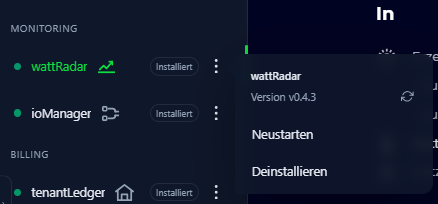
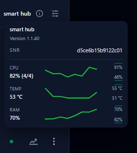
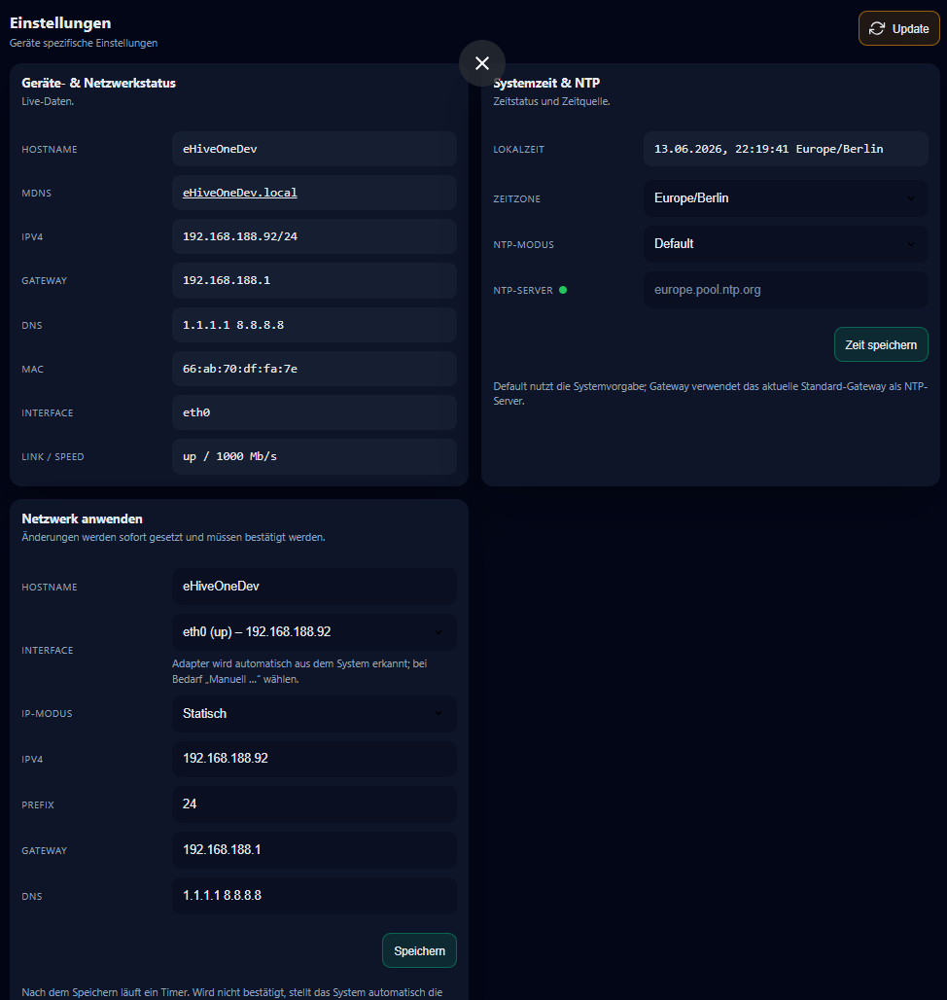

# SmartHub (Dashboard)

SmartHub ist das zentrale Dashboard von eHive One. Es listet verfügbare Apps, zeigt Status und bietet **Einstellungen** für Gerät, Netzwerk, Updates und Backups.

Dokumentierter Softwarestand: **SmartHub 1.1.40**

## Zweck

SmartHub ist der zentrale Einstieg für Betreiber und Support. Hier werden Apps geöffnet, App-Zustände geprüft und geschützte Gerätefunktionen wie Netzwerk, Passwort, Updates und Backups verwaltet.

## Öffnen

- Browser -> `http://ehiveone.local/` oder `http://<IP-ADRESSE>/`

## Login (Standard)

- Benutzer: `admin`
- Passwort: wird bei der Integration geändert bzw. durch das Gerätepasswort ersetzt.

Beim ersten Öffnen kann SmartHub das Setzen eines neuen Admin-Passworts erzwingen.

Für die Systemeinstellungen gibt es eine separate Anmeldung. Dadurch bleiben App-Ansicht und Gerätekonfiguration getrennt; Änderungen an Netzwerk, Passwort oder Systemfunktionen werden erst nach erneuter Authentifizierung zugänglich.

## Navigation

- Links in der Sidebar: Apps
- Statusanzeige pro App:
  - **on**: erreichbar
  - **off**: nicht erreichbar
  - **update**: Update verfügbar / Update-Modus

## App Store und App-Aktionen

SmartHub trennt die installierten Apps von der Store-Ansicht:

- **Apps** zeigt die installierten und erreichbaren Anwendungen.
- **App Store** zeigt vorbereitete oder verfügbare Apps mit Installationsstatus.
- Das Drei-Punkte-Menü einer App bietet je nach Zustand **Update**, **Neustarten**, **Installieren** oder **Deinstallieren**.
- Während Updates, Installationen oder Neustarts zeigt SmartHub ein Log-Panel und aktualisiert die App-Liste danach.

Im App-Store-/Verwaltungsmodus öffnet das Drei-Punkte-Menü die passenden Aktionen zur jeweiligen App. Bei installierten Apps sind zum Beispiel Neustart und Deinstallation sichtbar; bei nicht installierten Apps steht stattdessen die Installation im Vordergrund.

## Einstellungen

SmartHub -> **Einstellungen**:

### Geräte- & Netzwerkstatus

Zeigt u. a.:

- Hostname (`ehiveone`), mDNS
- IPv4, Gateway, DNS
- Interface, MAC
- Systeminformationen und Seriennummer

Die Systeminformationen zeigen Seriennummer, SmartHub-Version sowie CPU-, Temperatur- und RAM-Werte. Diese Ansicht ist besonders für Support und Wartung nützlich, weil die wichtigsten Gerätedaten ohne SSH direkt im Browser ablesbar sind.

### Netzwerk ändern

- Hostname setzen
- Interface auswählen
- IP-Modus: DHCP oder Statisch
- Änderungen werden per Dialog bestätigt (Rollback möglich)

Die erste Einstellungsansicht bündelt Geräte-, Netzwerk- und Remote-Access-Daten. Hier lässt sich nach der Inbetriebnahme prüfen, ob Hostname, IP-Adresse, Gateway, DNS und Schnittstelle zum geplanten Netzwerk passen.

### Passwort ändern

- aktuelles Passwort + neues Passwort (mind. 8 Zeichen empfohlen)

### System

- Neustart über Button (Bestätigung erforderlich)

Die zweite Einstellungsansicht fasst Passwortänderung und Systemaktionen zusammen. Dort wird das lokale Admin-Passwort geändert und ein Neustart bewusst über den Systembereich ausgelöst.

### Updates und Wiederherstellung

SmartHub stellt eine Update-/Rettungsoberfläche bereit:

- `http://ehiveone.local/update/`
- `http://<IP-ADRESSE>/update/`
- `http://<IP-ADRESSE>:3003/` als direkter Rettungszugriff

Details: [Updates](../maintenance/updates.md) und [Backup und Wiederherstellung](../maintenance/backup-restore.md).

## Prüfung nach Updates

- SmartHub öffnen und Version in den Systeminformationen prüfen.
- App-Liste laden und Statusanzeigen kontrollieren.
- App Store öffnen und Drei-Punkte-Menü einer App prüfen.
- Einstellungen nach erneuter Anmeldung öffnen.
- Netzwerkdaten, Passwortbereich und Systemaktionen sichtbar prüfen.
- Update-/Rettungsoberfläche über `/update/` erreichbar testen.

## Troubleshooting

- **SmartHub nicht erreichbar:** IP-Adresse, mDNS und NetMode prüfen.
- **App zeigt `off`:** App neu starten und danach App-Status erneut laden.
- **Einstellungen öffnen nicht:** Gerätepasswort prüfen und Browser neu laden.
- **Update-Aktion fehlt:** App Store aktualisieren und installierten App-Status prüfen.
