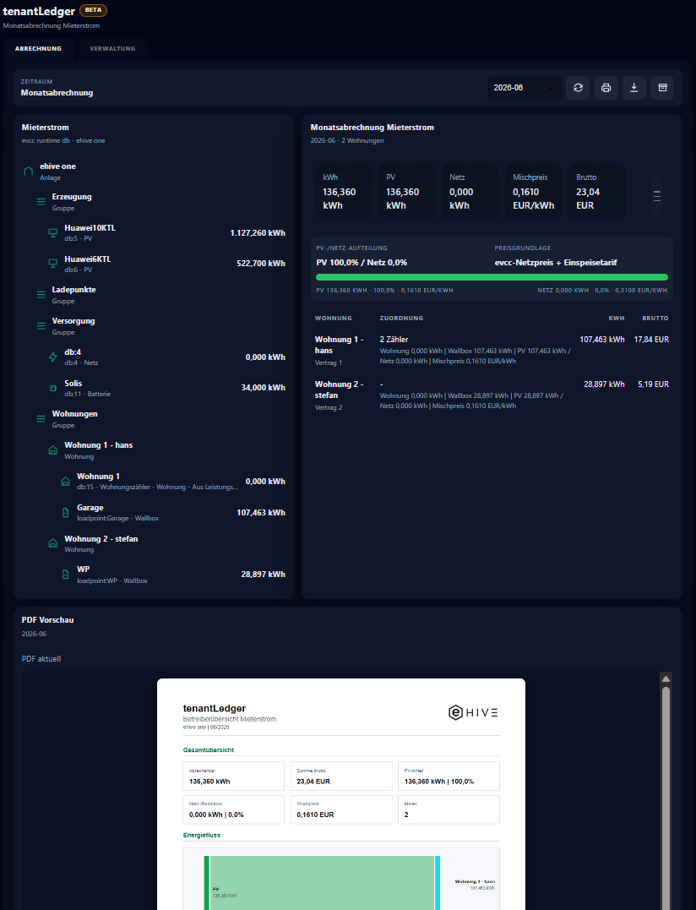

# tenantLedger

Mit tenantLedger wertest du Mieterstrom-, Wohnungs- oder Mieterabrechnungen technisch aus. Du ordnest Verbrauchswerte, Zähler und Preisbestandteile strukturiert zu und behältst PDF-Unterlagen nachvollziehbar im Blick; die rechtliche Prüfung bleibt separat.

Dokumentierter Softwarestand: **tenantLedger 0.1.8**

## Zugriff

- SmartHub öffnen.
- In der App-Liste **tenantLedger** auswählen.
- Falls die App nicht sichtbar ist, im SmartHub App Store prüfen, ob sie installiert und gestartet ist.

## Typische Nutzung

1. tenantLedger über SmartHub öffnen.
2. Standort, Zeitraum und Preisangaben prüfen.
3. Wohnungen/Mieter und Zählerzuordnungen prüfen.
4. PV-/Netzanteile und Verbrauchswerte plausibilisieren.
5. PDF-Vorschau prüfen.
6. PDF herunterladen oder archivieren.

## Funktionen

- Übersicht für Betreiber.
- Einzelabrechnung je Mieter/Wohnung.
- Zuordnung von Zählern und Quellen.
- Aufteilung von PV- und Netzanteilen.
- Berechnung von Verbrauch, Arbeitspreis, Grundpreis und Bruttobeträgen.
- PDF-Export mit Betreiberübersicht und Mieterabrechnungen.

## Status

Du nutzt tenantLedger als unterstützendes Werkzeug für technische Abrechnungsunterlagen. Die rechtliche und abrechnungstechnische Prüfung bleibt erforderlich.

## Wichtige Hinweise

- Zählerzuordnung, Preise, Zeiträume und Messwerte müssen vor Verwendung geprüft werden.
- Mieterstrom- und Abrechnungsmodelle können rechtliche, steuerliche und regulatorische Anforderungen auslösen.
- tenantLedger ersetzt keine Rechts-, Steuer- oder Messstellenprüfung.
- Für falsche Ausgangsdaten, falsche Zuordnung oder ungeprüfte Verwendung der Auswertung wird keine Gewährleistung übernommen.

## Prüfung nach Updates

- App in SmartHub öffnen.
- Zähler- und Wohnungszuordnung prüfen.
- Beispielzeitraum berechnen.
- PDF erzeugen und Werte plausibilisieren.
- Darstellung auf Desktop und Mobil prüfen.

## Troubleshooting

- **Wohnungen oder Zähler fehlen:** Verwaltungsansicht öffnen und Zuordnungen prüfen.
- **Beträge wirken unplausibel:** Zeitraum, Preise, PV-/Netzanteile und Messwerte kontrollieren.
- **PDF-Vorschau fehlt:** Browser aktualisieren und einen kleineren Beispielzeitraum testen.
- **Abrechnung darf nicht verwendet werden:** Rechtliche, steuerliche oder Messstellenfragen vor Weitergabe klären.

## Screenshots

### Verwaltung und Zuordnung

Die Verwaltungsansicht dient zum Prüfen und Pflegen der fachlichen Grundlage für die Abrechnung: Wohnungen, Zähler, Rollen, Preisparameter und Zuordnungen. Vor einer produktiven Auswertung müssen diese Daten vollständig und plausibel sein, weil sie direkt in die späteren Beträge und PDF-Unterlagen einfließen.

### Abrechnung und PDF-Vorschau

Die Abrechnungsansicht zeigt Monatsauswertung, Summen, Preisfluss und PDF-Vorschau. Hier werden die gepflegten Zuordnungen angewendet und die Werte für Betreiberübersicht sowie Mieterabrechnungen kontrolliert.

