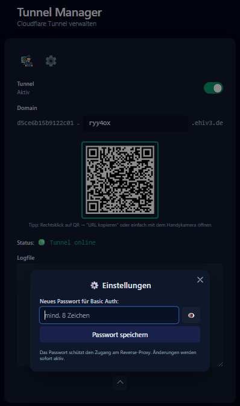
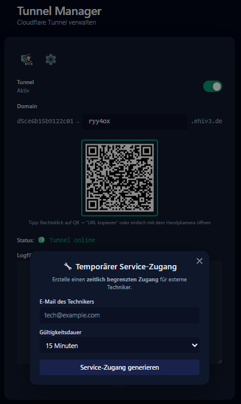

# Tunnel Manager (Remote-Zugriff)

Mit dem Tunnel Manager richtest du einen geschützten Remote-Zugriff auf die Weboberflächen des eHive One ein. Er erzeugt eine gerätebezogene Adresse, schützt den Zugriff per Passwort und stellt QR-Codes sowie temporäre Zugänge bereit.

- Veröffentlicht **nur Web-UIs**.
- Der Zugriff erfolgt über eine **seriennummernbasierte Subdomain** plus persönlichen **Hash**.
- SSH-Zugriffe sind nur für Servicefälle vorgesehen und müssen gezielt aktiviert und wieder deaktiviert werden.

## Zugriff & Login

- Öffne den Tunnel Manager über **SmartHub**.
- Standard-Zugang (Geräteauslieferung):
  - Benutzer: `admin`
  - Passwort: wird bei der Integration geändert bzw. durch das Gerätepasswort ersetzt.

## Typischer Ablauf

### 1. Remote-Zugriff aktivieren

1. Tunnel Manager öffnen.
2. Assistent/Setup starten.
3. Der Manager erzeugt eine Remote-Adresse nach dem Schema:
   - `<SERIAL>-<HASH>.<domain>`
4. Ein QR-Code kann angezeigt werden; abhängig vom Handy öffnet er die passende App oder Weboberfläche.

Das Dashboard zeigt Tunnelstatus, Domain- bzw. Hash-Feld, QR-Code und Statusmeldung. Hier wird geprüft, ob der Remote-Zugriff aktiv ist und welche Adresse bzw. welcher QR-Code für den Zugriff verwendet wird.

### 2. Hash neu erzeugen

Wenn eine URL weitergegeben wurde oder du den Zugriff rotieren willst:

1. **Neuen Hash erzeugen** auswählen.
2. Es wird eine neue Remote-Adresse generiert.
3. Den alten Link nicht weiterverwenden.

### 3. Passwort ändern

Der Tunnel Manager kann das Basic-Auth-Passwort des veröffentlichten Webzugriffs ändern. Die Änderung wird in der lokalen Konfiguration gespeichert und in die Caddy-Konfiguration übernommen.

Der Einstellungsdialog dient zur Vergabe des Passworts für den veröffentlichten Webzugriff. Nach dem Speichern ist dieses Passwort für den Zugriff über den Tunnel maßgeblich; Standard- oder Übergangspasswörter sollten nicht im produktiven Betrieb bleiben.

### 4. Temporärer Zugang für Support/Installateur

Für Supportfälle kann ein temporärer Zugang eingerichtet werden:

- Aktivieren -> Link/QR weitergeben
- Nach Abschluss: temporären Zugang **deaktivieren/entfernen**

Der Dialog für den temporären Service-Zugang nimmt E-Mail-Adresse und Laufzeit auf. Er ist für Supportfälle gedacht, in denen ein zeitlich begrenzter Zugriff benötigt wird; die Laufzeit sollte so kurz wie möglich gewählt und nach Abschluss entfernt werden.

## Sicherheit

- Default-Passwörter ändern.
- Remote-Zugriff nur aktiv lassen, wenn er benötigt wird.
- Links/QR-Codes nicht öffentlich teilen.
- Temporäre Zugänge nach Abschluss des Servicefalls entfernen.
- Bei Einsatz in kritischer Infrastruktur oder produktiven Unternehmensnetzen muss eHive One über eine Firewall bzw. geeignete Netzwerksegmentierung abgesichert werden.
- Remote-Zugriff und Firewall-Regeln müssen vor Aktivierung mit der zuständigen IT-/OT-Administration bzw. dem Betreiber abgestimmt werden.

Für Schäden durch unsachgemäße Freigaben, fehlende Firewall, fehlende Netzwerksegmentierung oder nicht abgestimmte Remote-Zugriffe wird - soweit gesetzlich zulässig - keine Gewährleistung oder Haftung übernommen. Bei Fragen zur sicheren Einbindung unterstützen wir gerne.

## Prüfung nach Updates

- Tunnel Manager über SmartHub öffnen.
- Tunnelstatus prüfen.
- QR-Code bzw. Remote-Adresse anzeigen lassen.
- Passwortdialog öffnen, ohne produktive Zugangsdaten unnötig zu ändern.
- Temporären Zugang testweise nur in einer kontrollierten Support-Situation anlegen.

## Troubleshooting

- **Tunnel bleibt inaktiv:** Netzwerk, DNS und ausgehende Verbindung prüfen.
- **Remote-Link funktioniert nicht:** Hash neu erzeugen und aktuellen Link verwenden.
- **Login schlägt fehl:** Tunnel-Passwort neu setzen und alte gespeicherte Browserdaten verwerfen.
- **Temporärer Zugang bleibt aktiv:** Zugang nach Abschluss im Tunnel Manager entfernen.
