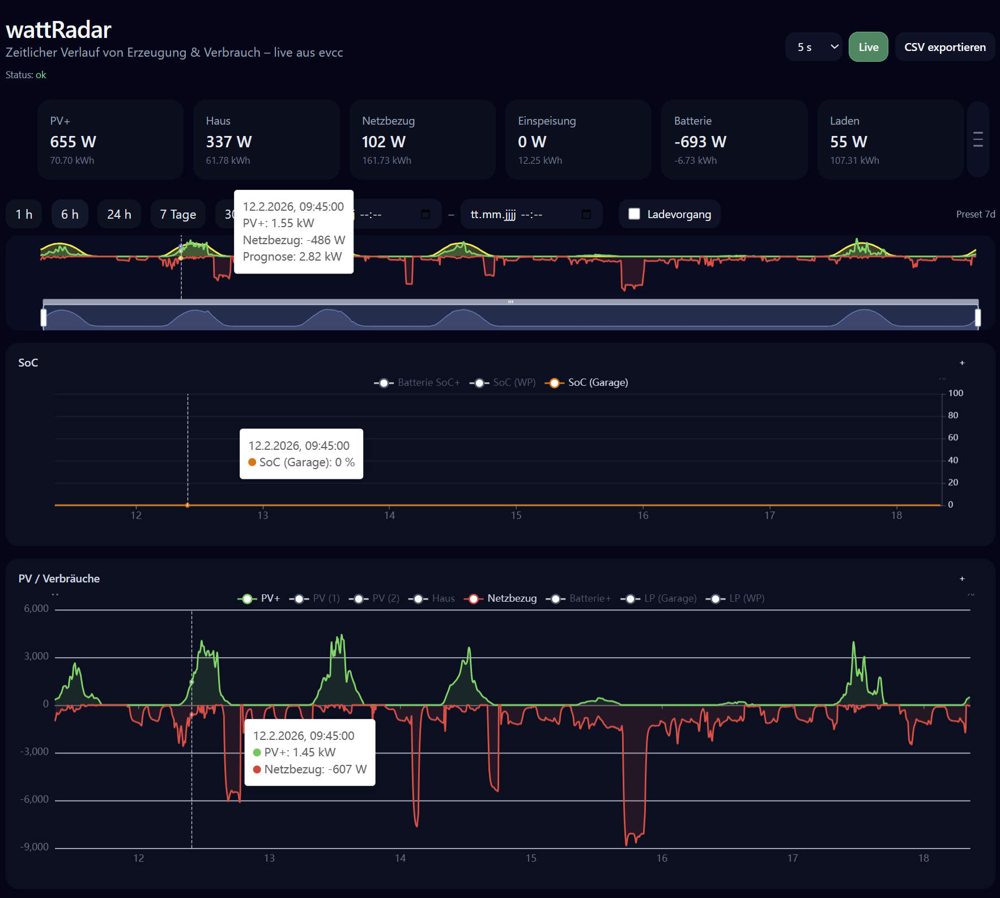

# WattRadar

WattRadar visualisiert Erzeugung/Verbrauch und weitere Energie‑Kennzahlen als zeitlichen Verlauf. Die Daten stammen aus der vorkonfigurierten evcc‑Datenbank (z. B. InfluxDB) – für Endanwender ist **keine Konfiguration** nötig.

## Oberfläche (Bedienung)

### Live‑Betrieb

- **Poll‑Intervall**: 2 s / 5 s / 10 s / 30 s
- **Live**: Live‑Polling an/aus
- **Statuszeile**: Verbindungsstatus, Fehlermeldungen
- **CSV exportieren**: Export des aktuell ausgewählten Zeitfensters

### Zeitfenster

- Presets: **1 h**, **6 h**, **24 h**, **7 Tage**, **30 Tage**
- Freies Zeitfenster: Von/Bis

### Diagramme

Die angezeigten Reihen orientieren sich an den in evcc verfügbaren Messwerten (je nach Setup), z. B.:

- Netzbezug/Einspeisung (Grid)
- PV‑Leistung/Ertrag
- Hausverbrauch
- Batterie (SoC/Leistung)
- Ladepunkte/Wallbox(en) und Ladevorgänge

Bedienung:

- **Zoom/Scroll** über die Timeline
- Reihen ein-/ausblenden (Legende/Checkboxes)
- Optional: Overlays für aktive Ladevorgänge

## Häufige Fragen

### „Keine Daten“ / leere Charts

- Zeitfenster vergrößern (z. B. 24 h statt 1 h).
- Prüfen, ob evcc Daten liefert (ggf. im Dashboard‑Status).
- Bei anhaltenden Problemen: Support kontaktieren.

## Erweiterte Diagnose (optional)

WattRadar kann Diagnose‑Ansichten bereitstellen (für Support/Fehleranalyse), z. B.:

- `/debug/influx`
- `/debug/inspect`
- `/debug/probe`

Diese sind für den normalen Betrieb nicht erforderlich.

## Screenshots

